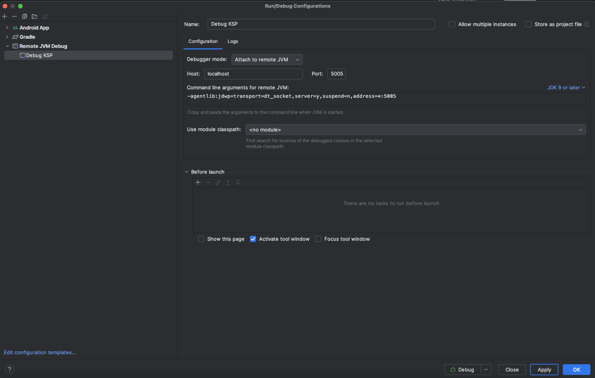

## Debugging KSP

1.) Start Compilation + Let it wait for Debugger Attache
./gradlew :demo:kspDebugKotlin -debug-rerun -Dorg.gradle.debug=true --no-daemon \
-Pkotlin.compiler.execution.strategy=in-process

2.) Setup Debug Config

